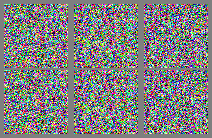

# Howto speedup stable-diffusion by 30%

## Idea
* The DDIMSampler not only calculates the next step in latent space ('x_inter')
* But also uses a latent prediction 'pred_x0' internally, which is ahead
* See visualization of the latents during an image generation process below

  3 samples for "An astronaut riding a horse", 50 ddim_steps  
  ('x_inter' latent in the top row, associated 'pred_x0' in the bottom)

    
    
### Let's use the 'pred_x0' predictions instead of the latents to generate images and see what happens!

## Quick'n'dirty hack
In ldm/models/diffusion/ddim.py  
exit the ddim_sampling loop prematurely  
and return 'pred_x0' instead of the final latent

(I have passed a 'fast_mode' switch all the way down, but there should be a better solutions)

    class DDIMSampler(object):
        ...
        @torch.no_grad()
        def ddim_sampling(self, cond, shape,
            ...
                if fast_mode and i>=int(7.*total_steps/10.):
                    return pred_x0, intermediates
            return img, intermediates
        
        @torch.no_grad()
        def decode(self, x_latent, cond, t_start, unconditional_guidance_scale=1.0, unconditional_conditioning=None,
            ...
                if fast_mode and i>=int(7.*total_steps/10.):
                    return pred_x0, intermediates
            return x_dec, intermediates

## Results
* If you exit sampling process 30% earlier and use 'pred_x0' instead of 'x_inter' for image generation you get an image depicting the same content, just with a little bit less details. The rows in figure below show in comparison:
    - images generated from latents 'x_inter' in step 35 (of 50 ddim_steps)
    - images generated from prediction 'pred_x0' in step 35
    - difference between the step 35 predictions to
    - images generated from the final latents 'x_inter' after 50 ddim_steps
    
    
    
    

    
